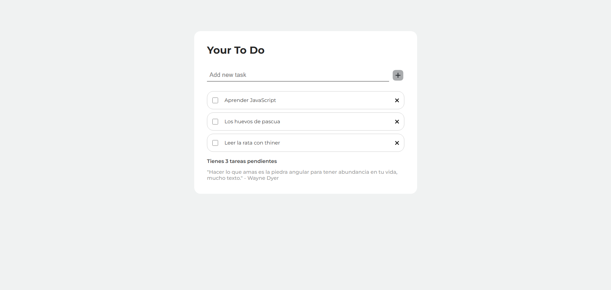

# ToDo App

> Una aplicación de gestión de tareas limpia y modular creada con JavaScript básico y patrones de arquitectura modernos.

## Screenshots

### Vista principal


## Descripcion

Aplicación de gestión de tareas construida desde cero para practicar conceptos fundamentales de JavaScript, arquitectura de software y mejores prácticas de desarrollo. El proyecto implementa una arquitectura modular con separación clara de responsabilidades.

## ✨ Características principales

- ✅ Crear, editar y eliminar tareas
- ✅ Marcar tareas como completadas/incompletas
- ✅ Filtrar tareas por estado (Todas/Activas/Completadas)
- ✅ Asignar niveles de prioridad (Alta/Media/Baja)
- ✅ Persistencia de datos con LocalStorage
- ✅ Contador dinámico de tareas pendientes
- ✅ Interfaz responsive y minimalista

## 🛠️ Stack Tecnológico

**Frontend:**
- JavaScript (ES6+)
- HTML5
- CSS3

**Herramientas:**
- Vite - Build tool y dev server
- UUID - Generación de IDs únicos
- Git - Control de versiones

## Arquitectura del Proyecto

El proyecto sigue una arquitectura modular con separación de responsabilidades:

```plaintext
src/
├── state/
│   └── todos-state.js          # Estado centralizado con getters/setters
├── storage/
│   └── local-storage.js        # Persistencia con localStorage
├── use-cases/
│   ├── add-todo.js             # Lógica para agregar tareas
│   ├── delete-todo.js          # Lógica para eliminar tareas
│   ├── toggle-todo.js          # Lógica para toggle completado
│   └── index.js                # Barrel file
├── ui/
│   ├── render-todos.js         # Renderizado del DOM
│   └── update-counter.js       # Actualización del contador
├── main.js                     # Orquestador principal
└── style.css                   # Estilos
```

## Patrones y Principios Aplicados

- Separación de Responsabilidades: Cada módulo tiene un propósito específico
- Encapsulación: El estado solo se modifica a través de funciones específicas
- Event Delegation: Manejo eficiente de eventos en elementos dinámicos
- Single Source of Truth: Estado centralizado
- Barrel Files: Exports centralizados para mejor DX

## 💻 Instalación Local
```bash
# Clonar repositorio
git clone https://github.com/tu-usuario/todo-app.git

# Navegar al directorio
cd todo-app

# Instalar dependencias
npm install

# Iniciar servidor de desarrollo
npm run dev
```
El proyecto estará disponible en http://localhost:5173


## Estructura del estado
Cada tarea tiene la siguiente estructura:
```javascript
{
  id: "uuid-generado",
  text: "Descripción de la tarea",
  completed: false,
  priority: "medium" // "high" | "medium" | "low"
}


## 👤 Autor
**Daniel Lubo**

- GitHub: [@DanielLubo](https://github.com/DanielLubo)
- LinkedIn: [Daniel Lubo](www.linkedin.com/in/danilubo)

## 📜 Licencia
Este proyecto está bajo la [Licencia MIT](LICENSE) - ver el archivo `LICENSE` para más detalles.
